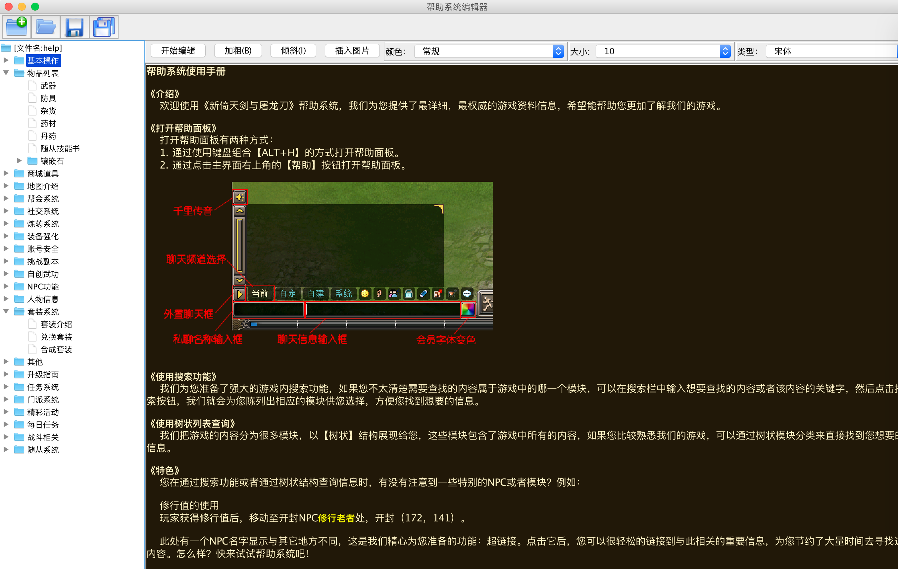

helpeditor
==========

### 简介

耗时一周实现简易帮助文档编辑器,UI采用swing,目前支持如下功能

- 文件目录与文件增删改
- 自定义存储文件格式
- 定时自动保存
- 文本加粗
- 文本斜体
- 文本颜色
- 图片插入
- ...

### 使用

#### 运行程序

程序入口: **com/help/HelpEditor.java**

游戏帮助文档效果展示(默认打开仓库中的文件help.cfg):

